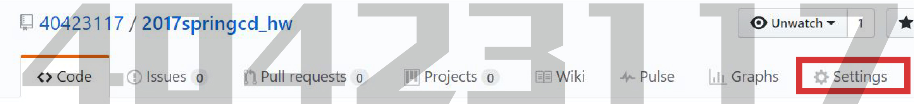
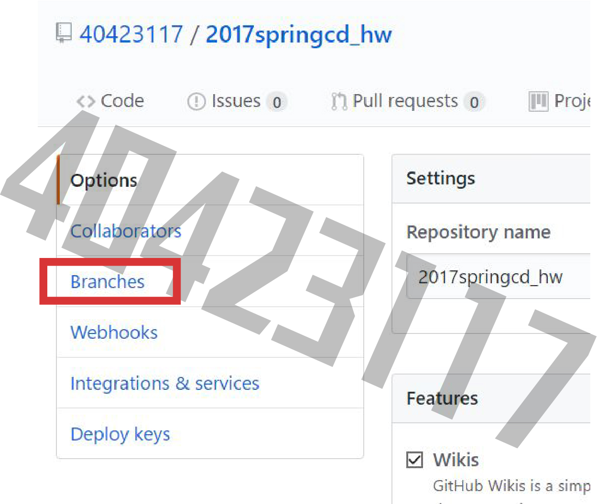
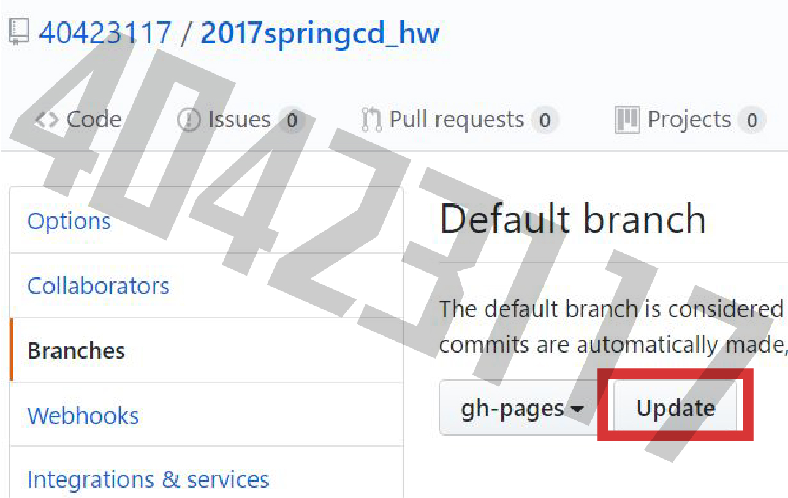
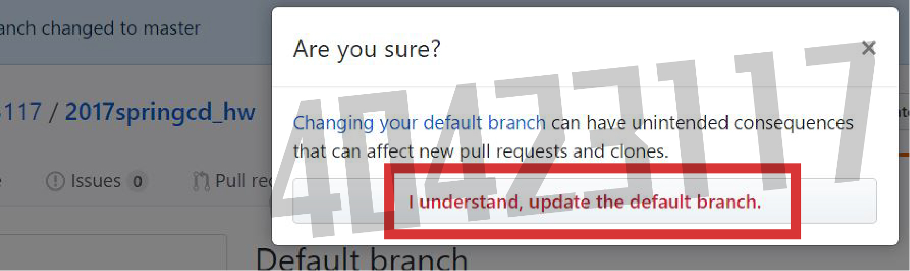
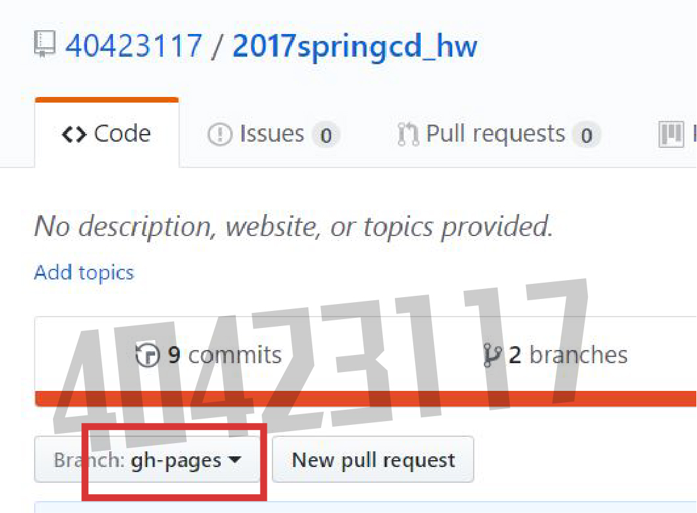

Title: [Github] 默認倉儲設定
Date: 2017-02-23 11:02
Category: Course
Tags: week1, github
Slug: week1_1
Author: 40423117

[<b>設定Github之默認倉儲</b>]

<!-- PELICAN_END_SUMMARY -->

<button onClick="lity('https://www.youtube.com/embed/v3405VKTXoQ?rel=0')">教學影片</button>

### [Github] 默認倉儲設定

先進入自己的倉儲後，點選 Setting

進入 Setting後，點選 Branch

在Default branch下設定自己想默認的倉儲，這邊預設為 `gh-pages`

點選 Update

點選 I understand,update the default branch.

回到自己的倉儲後，默認倉儲就是剛剛設定的倉儲

  