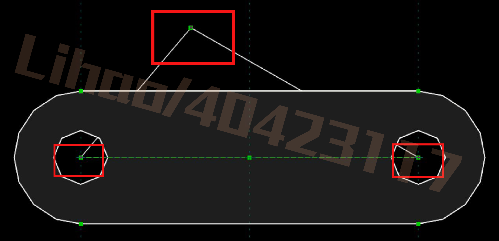
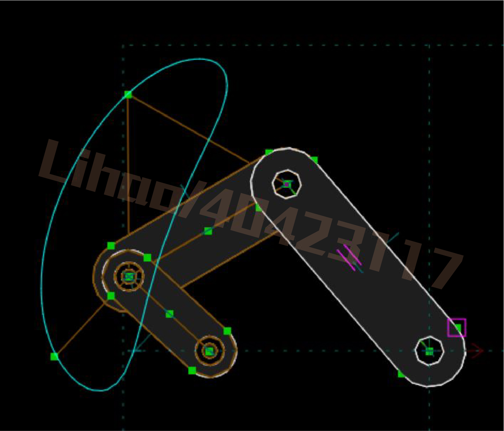
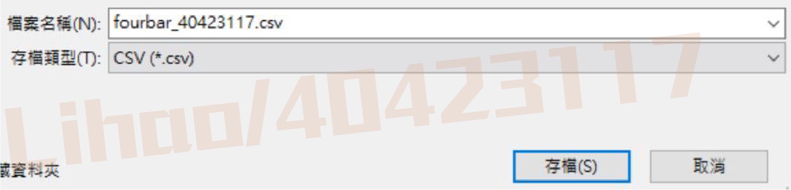
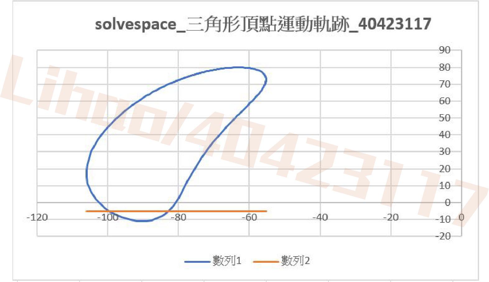

Title: [Week 3] 課程內容整理
Date: 2017-03-09 11:00
Category: Course
Tags: week3
Slug: week3
Author: 40423117

[Week 3] 第三週課程內容概要整理。

1. 翻譯<button onClick="lity('https://40423117.github.io/2017springcd_hw/blog/week3_1.html')"> Hyperworker1</button>、<button onClick="lity('https://40423117.github.io/2017springcd_hw/blog/week3_2.html')"> Hyperworker3</button>
2. 利用solvespace組立及v-rep轉入
3. Solvespace 輸入三角形頂點運動軌跡

<!-- PELICAN_END_SUMMARY -->

### solvespace 影片教學

<button onClick="lity('https://www.youtube.com/embed/1MNClElz85g?rel=0')"> link_30影片</button>
<button onClick="lity('https://www.youtube.com/embed/ZRmordUEods?rel=0')"> link_50影片</button>
<button onClick="lity('https://www.youtube.com/embed/GxHJHj9Syfw?rel=0')"> link_60影片</button>
<button onClick="lity('https://www.youtube.com/embed/Aq9CxzepNR0?rel=0')"> 組立影片</button>

### solvespace 零件檔領取

  * [link_30.slvs](https://40423117.github.io/2017springcd_hw/data/w2/link_30.slvs)
  
  * [link_50.slvs](https://40423117.github.io/2017springcd_hw/data/w2/link_50.slvs)

  * [link_60.slvs](https://40423117.github.io/2017springcd_hw/data/w2/link_60.slvs)
  
  * [組立檔](https://40423117.github.io/2017springcd_hw/data/w2/fourbar345.slvs)

### 利用solvespace組立及v-rep轉入

<button onClick="lity('https://www.youtube.com/embed/https://youtu.be/8NDm0-W1Dqk?rel=0')"> SolveSpace組立及v-rep轉入_Tutorial</button>

### 三角形運動軌跡輸出CSV至EXCEL查看

<button onClick="lity('https://www.youtube.com/embed/5vKZ3MwfgM8?rel=0')"> SolveSpace_W3_Tutorial</button><button onClick="lity('https://www.youtube.com/embed/L__eySIuBTk?rel=0')"> 105_1_CSVTOEXCEL_Tutorial</button><button onClick="lity('https://www.youtube.com/embed/-eltLhLblRM?rel=0')"> 105_2_CSVTOEXCEL_Tutorial</button>

先在link_50零件中，於兩個圓心上畫出一個相交的兩條線

尺寸各為50

接著先點選三角形之頂點，接著點選Analyze，再點選Trace Point

任意點選一個點，讓軌跡運動

接著再點選Analyze，點選 Stop Tracing...

請存成 CSV格式

於EXCEL上，以點建立圖表

