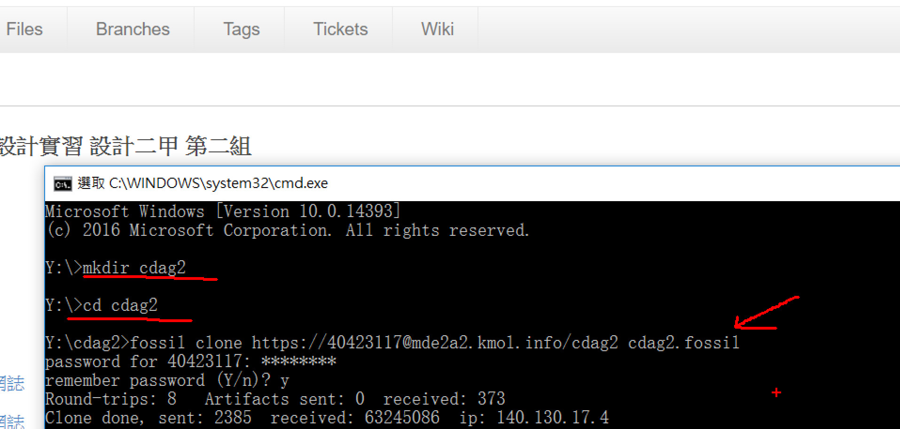
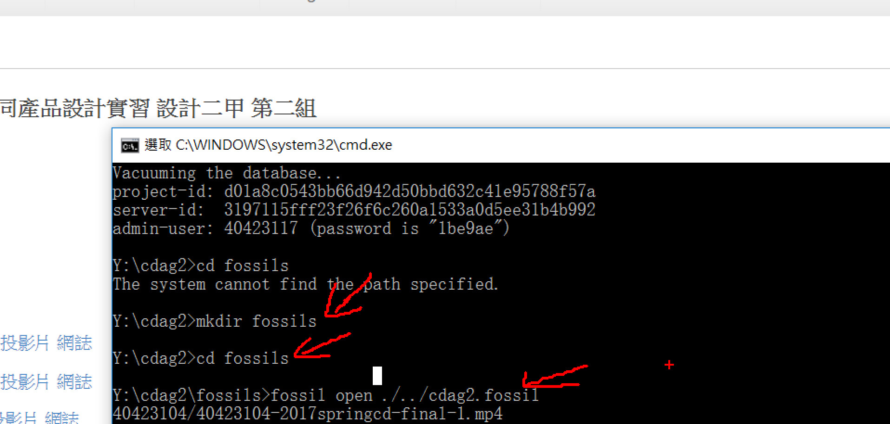
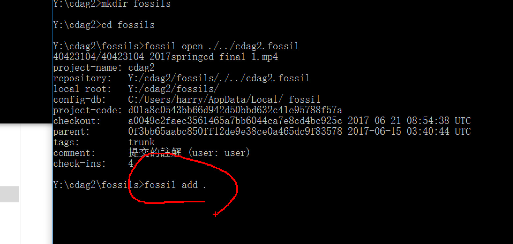
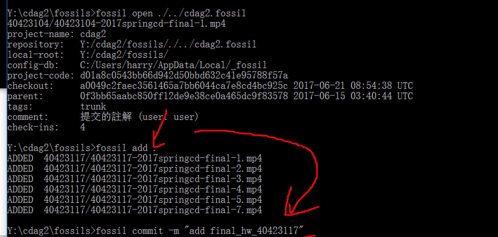
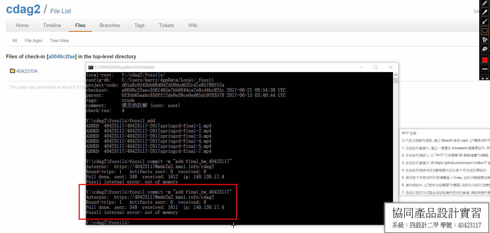

Title: [Week 16] Fossil 作業上傳
Date: 2017-06-08 11:00
Category: Course
Tags: week16
Slug: week16
Author: 40423117

[Week 16] 第十六週課程內容概要整理。

1. 老師今天要同學，使用 Fossil 將作業檔案上傳

<!-- PELICAN_END_SUMMARY -->

### Download fossil →  Upload fossil

<button onClick="lity('https://www.youtube.com/embed/8_40JZBbh_w?rel=0')"> 影片點我觀看 </button>

### 講解：

[mkdir]為建立一個名為 cdag2 的資料夾，[cd] 為進去名為 cdag2 的資料夾  [註：cdag2 為我本學期的組別，同學請自行更改]

<code>mkdir cdag2</code>  <code>cd cdag2</code> 

讓 fossil 能夠自動上傳 [註：cdag2 為我本學期的組別，同學請自行更改]

<code>fossil clone https://帳號@mde2a2.kmol.info/cdag2 cdag2.fossil</code> 

[mkdir]為建立一個名為 fossils 的資料夾，[cd] 為進去名為 fossils 的資料夾  [註：這個資料夾為開啟fossils用]

<code>mkdir fossils</code>  <code>cd fossils</code> 

進到裡面後開啟fossil，<b>如果沒有此步驟，則cdag2.fossil檔案會跟著上傳哦！</b>

<code>fossil open ./../cdag2.fossil</code> 

告訴fossil加入了所有檔案

<code>fossil add .</code> 

Commit訊息  [註：因在第一步驟fossil clone的設置，Commit完後會自動提交]

<code>fossil commit -m "add final_hw_40423117"</code> 

等待將檔案上傳完畢即可。  [Cdag2.html](https://mde2a2.kmol.info/cdag2/home)

